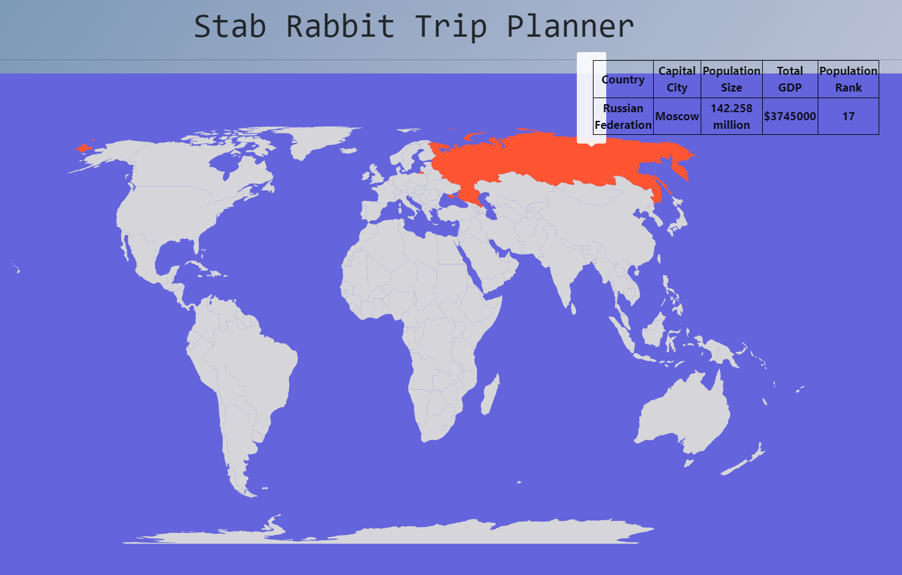
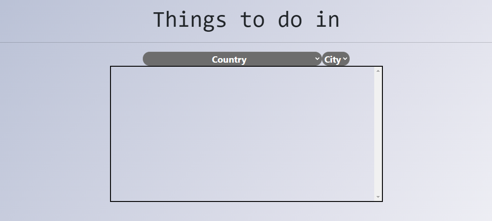

# Welcome to Stab Rabbit Trip Planner

Stab Rabbit Trip Planner is a lightweight, React based trip planner and destination API aggregator. There is no app to map and track places that you have visited or plan to visit with information about the location (wikipedia, attractions, etc.). Stab Rabbit Trip Planner brings together a map view with a dashboard for trip history and planning utilities for exploration

 

 

### Features
* Filter for travel destinations
* Filter for flight lists with costs
* Highlight popular destinations for country highlighted
* View information about destinations
* Interactive Map
* Tool-tip hover over countries to view details

### Built With

- React
- Redux
- React Router
- Chart.js
- Material UI
- React Testing Library
- Jest

### Authors

- **Abeer Faizan** - [@abeer-f](https://github.com/abeer-f)
- **Jay Wall** - [hanswand](https://github.com/hanswand)
- **Stephen Kim** - [@stephenkim612](https://github.com/stephenkim612)
- **Leonard Lew** - [@leolew97](https://github.com/leolew97)
- **Victor Wang** - [@wangvwr](https://github.com/people/wangvwr)

#### License

This project is licensed under the MIT License